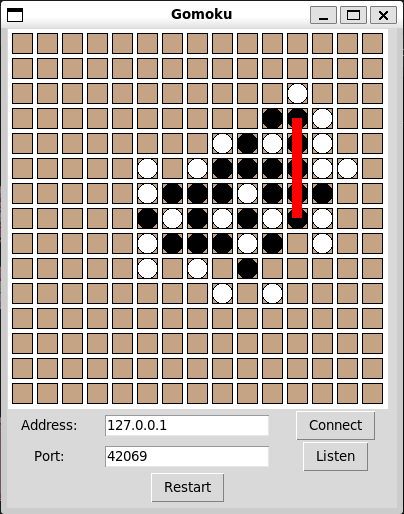

# py-gomoku

This is a simple Gomoku game made in Python for two players. The game can be played locally or online, and it features a Tkinter GUI with no other dependencies. Two versions are available:
  - **Listen Version**: A single file where either player can be a client or a host.
  - **Client-Server Version**: An explicit client-server configuration with separate game logic and GUI applications.

## Usage
Ensure you have Python (version 3.6 or higher) and tkinter installed.
### Listen Version
Simply run the gomoku_listen.py file:

~~~bash
python gomoku_listen.py
~~~
Then click the appropriate button to either host a game or join a game as a client.

### Client-Server Version
If needed, you may adjust the server port number in the file itself by editing the number assigned to PORT near the top of the file.
Start the server:
~~~bash
python client_server/gomoku_server.py
~~~

Then start the clients:
~~~bash
python client_server/gomoku_client.py
~~~

Click the connect button on both clients to connect to the server and start playing. Keep in mind this version is not nearly as robust, but is included as a working concept and for those who might want to use it as a starting step of sorts.

## How to Play
- The game is played on a 15x15 grid.
- Players take turns placing their stones (black or white) on the board.
- The objective is to get five of your stones in a row, either horizontally, vertically, or diagonally.

## License
This project is licensed under the GPLv3 License. See the LICENSE file for details.
